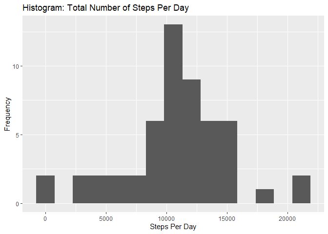
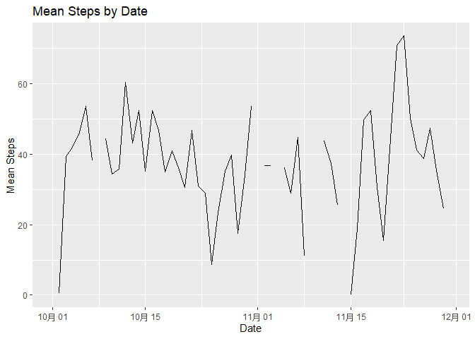
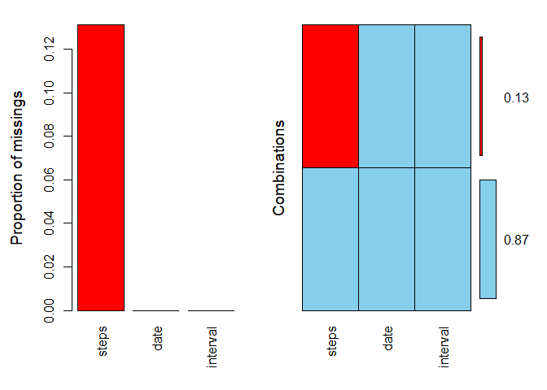
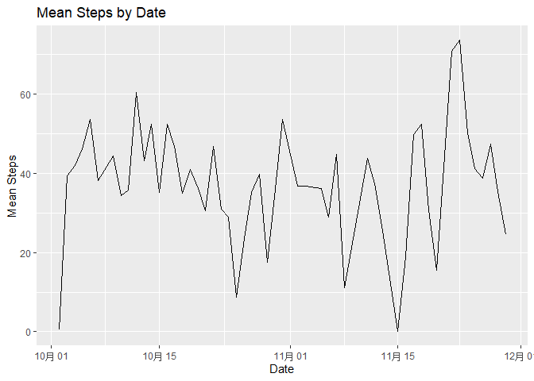
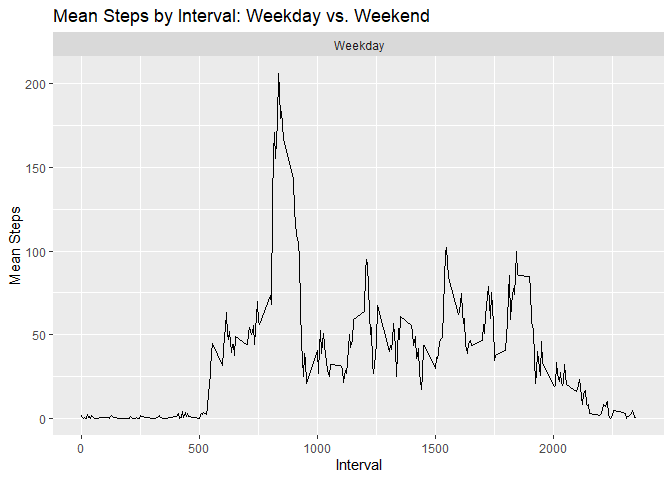
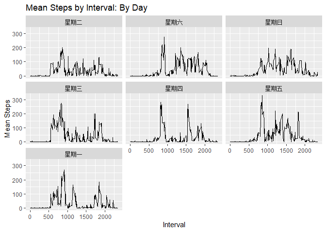

## set up

```r
library(readr)
```

```
## Warning: package 'readr' was built under R version 4.0.3
```

```r
library(tidyr)
```

```
## Warning: package 'tidyr' was built under R version 4.0.3
```

```r
library(dplyr)
```

```
## Warning: package 'dplyr' was built under R version 4.0.2
```

```
## 
## Attaching package: 'dplyr'
```

```
## The following objects are masked from 'package:stats':
## 
##     filter, lag
```

```
## The following objects are masked from 'package:base':
## 
##     intersect, setdiff, setequal, union
```

```r
library(ggplot2)
```

```
## Warning: package 'ggplot2' was built under R version 4.0.3
```

```r
library(VIM)
```

```
## Warning: package 'VIM' was built under R version 4.0.3
```

```
## Loading required package: colorspace
```

```
## Warning: package 'colorspace' was built under R version 4.0.3
```

```
## Loading required package: grid
```

```
## VIM is ready to use.
```

```
## Suggestions and bug-reports can be submitted at: https://github.com/statistikat/VIM/issues
```

```
## 
## Attaching package: 'VIM'
```

```
## The following object is masked from 'package:datasets':
## 
##     sleep
```

```r
library(mice)
```

```
## Warning: package 'mice' was built under R version 4.0.3
```

```
## 
## Attaching package: 'mice'
```

```
## The following object is masked from 'package:stats':
## 
##     filter
```

```
## The following objects are masked from 'package:base':
## 
##     cbind, rbind
```

```r
set.seed(1010)
```

## 1. Code for reading in the dataset and/or processing the data

```r
activity <- read_csv("activity.csv")
```

```
## 
## -- Column specification --------------------------------------------
## cols(
##   steps = col_double(),
##   date = col_date(format = ""),
##   interval = col_double()
## )
```
## 2. Histogram of the total number of steps taken each day

```r
activity %>% group_by(date) %>% summarise(stepsPerDay = sum(steps)) %>% 
  ggplot(aes(x = stepsPerDay)) + geom_histogram(bins = 15) + 
  ggtitle("Histogram: Total Number of Steps Per Day") + xlab("Steps Per Day") + 
  ylab("Frequency")
```

```
## `summarise()` ungrouping output (override with `.groups` argument)
```

```
## Warning: Removed 8 rows containing non-finite values (stat_bin).
```

<!-- -->

## 3. Mean and median number of steps taken each day
### Mean steps, missing values removed

```r
activity %>% group_by(date) %>% 
  summarise(meanStepsPerDay = mean(steps, na.rm = TRUE)) %>% 
  summarise(meanSteps = mean(meanStepsPerDay, na.rm = TRUE))
```

```
## `summarise()` ungrouping output (override with `.groups` argument)
```

```
## # A tibble: 1 x 1
##   meanSteps
##       <dbl>
## 1      37.4
```
### Median steps, missing values removed

```r
activity %>% group_by(date) %>% 
  summarise(medianStepsPerDay = median(steps, na.rm = TRUE)) %>%
  summarise(medianSteps = median(medianStepsPerDay, na.rm = TRUE))
```

```
## `summarise()` ungrouping output (override with `.groups` argument)
```

```
## # A tibble: 1 x 1
##   medianSteps
##         <dbl>
## 1           0
```
There are some missing values in the data set, the mean and median functions require their removal.

## 4.Time series plot of the average number of steps taken

```r
activity %>% group_by(date) %>% summarise(meanSteps = mean(steps, na.rm = TRUE)) %>%
  ggplot(aes(x = date, y = meanSteps)) + geom_line() + 
  ggtitle("Mean Steps by Date") + xlab("Date") + ylab("Mean Steps")
```

```
## `summarise()` ungrouping output (override with `.groups` argument)
```

```
## Warning: Removed 2 row(s) containing missing values (geom_path).
```

<!-- -->
## 5. The 5-minute interval that, on average, contains the maximum number of steps

```r
activity %>% group_by(interval) %>% 
  summarize(meanByInterval = mean(steps, na.rm = TRUE)) %>%
  filter(meanByInterval == max(meanByInterval))
```

```
## `summarise()` ungrouping output (override with `.groups` argument)
```

```
## # A tibble: 1 x 2
##   interval meanByInterval
##      <dbl>          <dbl>
## 1      835           206.
```
the average is 835 that containes the maximum number of steps.
### The 5-minute interval that, on average, contains the minimum number of steps

```r
activity %>% group_by(interval) %>% 
  summarize(meanByInterval = mean(steps, na.rm = TRUE)) %>%
  filter(meanByInterval == min(meanByInterval))
```

```
## `summarise()` ungrouping output (override with `.groups` argument)
```

```
## # A tibble: 19 x 2
##    interval meanByInterval
##       <dbl>          <dbl>
##  1       40              0
##  2      120              0
##  3      155              0
##  4      200              0
##  5      205              0
##  6      215              0
##  7      220              0
##  8      230              0
##  9      240              0
## 10      245              0
## 11      300              0
## 12      305              0
## 13      310              0
## 14      315              0
## 15      350              0
## 16      355              0
## 17      415              0
## 18      500              0
## 19     2310              0
```
There are nineteen intervals on average, that contain the min number of steps.

## 6. Code to describe and show a strategy for imputing missing data
### Missing values by variable

```r
md.pattern(activity)
```

<!-- -->

```
##       date interval steps     
## 15264    1        1     1    0
## 2304     1        1     0    1
##          0        0  2304 2304
```


```r
(missing <- sum(is.na(activity)))
```

```
## [1] 2304
```
There are 2304 missing values in the data set. 

### Missing Values as percent of total

```r
missingPercent <- sum(is.na(activity))/(dim(activity)[1]*dim(activity)[2]) * 100 
pMiss <- function(x) { sum(is.na(x)) / length(x) * 100}
(missingPercentCol <-apply(activity, 2, pMiss))
```

```
##    steps     date interval 
## 13.11475  0.00000  0.00000
```
The missing values represent 4.372 percent of the total data, and 13.11 percent of the steps variable.
### Missing values visualization

```r
aggr(activity, numbers = TRUE)
```

<!-- -->
### Missing values strategy: take complete cases only

```r
activityNoMissing <- activity[complete.cases(activity),]
```

## 7. Histogram of the total number of steps taken each day after missing values are removed

```r
activityNoMissing %>% group_by(date) %>% summarise(stepsPerDay = sum(steps)) %>% 
  ggplot(aes(x = stepsPerDay)) + geom_histogram(bins = 15) + 
  ggtitle("Histogram: Total Number of Steps Per Day") + xlab("Steps Per Day") + 
  ylab("Frequency")
```

```
## `summarise()` ungrouping output (override with `.groups` argument)
```

<!-- -->


```r
activityNoMissing %>% group_by(date) %>% summarise(meanSteps = mean(steps, na.rm = TRUE)) %>%
  ggplot(aes(x = date, y = meanSteps)) + geom_line() + 
  ggtitle("Mean Steps by Date") + xlab("Date") + ylab("Mean Steps")
```

```
## `summarise()` ungrouping output (override with `.groups` argument)
```

<!-- -->

## 8. Panel plot comparing the average number of steps taken per 5-minute interval across weekdays and weekends
### By Weekday vs. Weekend

```r
t <- activityNoMissing %>% mutate(dayOfWeek = weekdays(date)) %>%
  mutate(Weekend = ifelse(dayOfWeek == "Saturday" | dayOfWeek == "Sunday", "Weekend", "Weekday"))
```

```r
## By Weekday vs. Weekend 
t %>% 
  group_by(Weekend, interval) %>% mutate(meanStepsInterval = mean(steps)) %>%
  ggplot(aes(x = interval, y = meanStepsInterval)) + geom_line() +
  facet_wrap(~Weekend) +ggtitle("Mean Steps by Interval: Weekday vs. Weekend") + 
  xlab("Interval") + ylab("Mean Steps")
```

<!-- -->

### By Days of the Week

```r
t %>%
  group_by(dayOfWeek, interval) %>% mutate(meanStepsInterval = mean(steps)) %>%
  ggplot(aes(x = interval, y = meanStepsInterval)) + geom_line() +
  facet_wrap(~dayOfWeek) +ggtitle("Mean Steps by Interval: By Day") +
  xlab("Interval") + ylab("Mean Steps")
```

<!-- -->

